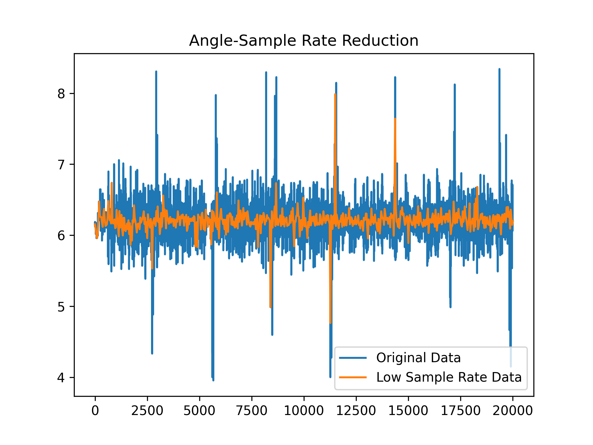

# Summer Project

## Preprocessing

### March 30 2025 (Night)
def mat_reader:

This function is used to extract information from original mat file in standard method.

def sample_rate_normalize:

This function unifies the sample rates from different sources.

Example-Results after 'sample_rate_normalize'

----
***Next Step***

I need to determine whether some abnormal fluctuations in the signal are meaningful information or just noise. The approach is to visualize the signal and analyze synchronized video recordings to observe muscle activity. By comparing the signal changes with the muscle movements, I can assess whether the fluctuations are abnormal or irrelevant.

