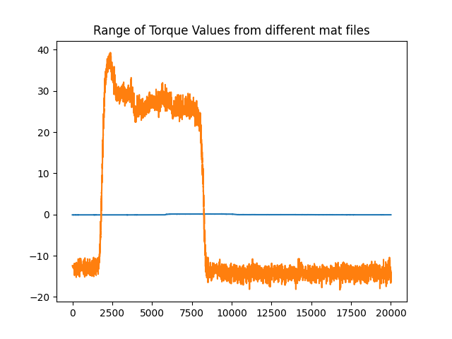
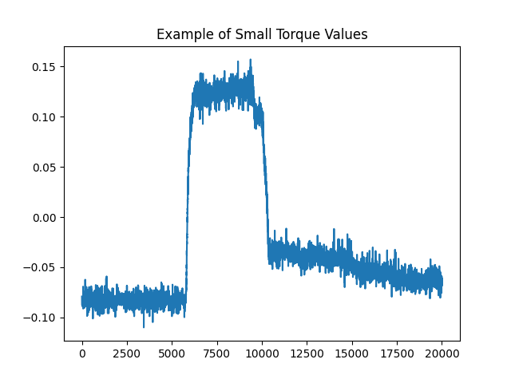

# Summer Project

## Preprocessing

def mat_reader:

This function is used to extract information from original mat file in standard method.

def sample_rate_normalize:

This function unifies the sample rates from different sources.

Example-Results after 'sample_rate_normalize'

Example-Results after denoising

Example-video of ultrasound images and its information
[Download Video](up_test1.mp4)

----
***Next Step***

variant range of torque values

some datasets store torque values in really small values
some datasets store torque values in large values

I guess the researcher standardized the torque value with its mean and stand deviation

May I get the exact mean and std to unify the value range reversely.

Comparison:

| Input Range                        | Loss Stability | Convergence Speed | Training Stability |
|-----------------------------------|----------------|-------------------|--------------------|
| `[0, 255]` (Raw Pixel Values)     | High Fluctuation | Slow            | Poor               |
| `[0, 1]` (Min-Max Normalization)  | Stable          | Fast              | Good               |
| `mean=0, std=1` (Z-score Standardization) | Very Stable     | Very Fast         | Excellent          |

----
## Log

### FINISH [March 31 2025 (Morning)]

I need to determine whether some abnormal fluctuations in the signal are meaningful information or just noise.
The approach is to visualize the signal and analyze synchronized video recordings to observe muscle activity.
By comparing the signal changes with the muscle movements, I can assess whether the fluctuations are abnormal or irrelevant.

### FINISH [March 31 2025 (Night)]

I need to align all sample rates in mat file.

### FINISH [March 31 2025 (Night)]

Create Videos & Pre-processed dataset

### FINISH [March 31 2025 (Night)]

I find that the ultrasound image from different experiments are variant. Some of them are bright.
Some of them are dark. More specifically, the muscle texture may clear in some ultrasound images.
This is one of the main problem during data collections. I need to find some strategies to solve those
domain shift.

Now, I will normalize all images to mean=0, std=1. ***(Z-score Normalization / Standardization)***

I firstly calculate the global mean and global std among all the datasets, which I will use.

Then:

norm_ultrasound = (ultrasound - global_mean) / global_std

Comparison:

| Input Range                        | Loss Stability | Convergence Speed | Training Stability |
|-----------------------------------|----------------|-------------------|--------------------|
| `[0, 255]` (Raw Pixel Values)     | High Fluctuation | Slow            | Poor               |
| `[0, 1]` (Min-Max Normalization)  | Stable          | Fast              | Good               |
| `mean=0, std=1` (Z-score Standardization) | Very Stable     | Very Fast         | Excellent          |

