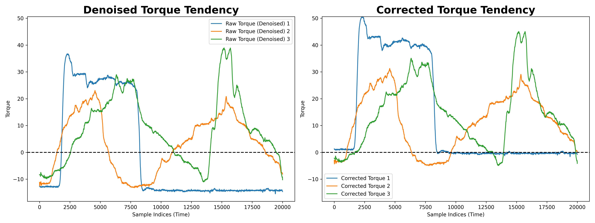

# Summer Project
Can Deep Learning Models success to handle regression problems in biomedical image processing.

## Preprocessing

IN PROGRESS !!!

## Model Design And Training

### Vanilla CNN Model

### Active Contraction State Classifier

The distribution of active and inactive contraction state is unequal.
Should we train another model serving for binary classification?

### Can auto-encoder assist us to solve the regression problem?

if classifier is helpful:
1. Semi-supervised Autoencoder (attach a binary classifier to enhance the sensitivity of active contraction frame)
2. Train two autoencoders after binary classifier

### Can other corresponding information (Angle/Angular Velocity) help  to solve the regression problem

### Can frame index help to solve the regression problem

----
***Next Step***

I would like to test different strategies of ultrasound image preprocessing. I want to see firstly whether
variant preprocesses can deteriorate the accuracy of deep learning model. Which method is the most suitable
one respect to our project at this time. In the future, when we want to deeply analyze the research problem,
we can utilize the fittest dataset for more complex models.

I need to prepare five different for this small experiments:

No Preprocess (Baseline):
1. We use raw intensity values, then feed to the model.

Standardization Method (mean 0 / std 1, or we say ***x ~ N(0, 1)***, x is one ultrasound image)
1. We use the mean and std of TS01, then standardize TS01 and TS02.
2. We use the mean and std of TS02, then standardize TS01 and TS02 **(control experiment)**.
3. We use the global mean and global std (TS01 & TS02), then standardize TS01 and TS02.

Histogram Matching Method
1. We use the first image in the TS01 to match all the rest ultrasound images.

***Overview***

| Strategy ID | Method                        | Description                                                           | Mean Unified? | Std Unified? | Distribution Shape                | Notes                                             |
|-------------|-------------------------------|-----------------------------------------------------------------------|---------------|--------------|------------------------------------|---------------------------------------------------|
| **S1**      | No Preprocess                 | Use raw ultrasound images without any normalization.                 | ❌            | ❌           | Highly variant across subjects     | Baseline; may overfit to individual subjects      |
| **S2**      | Standardization (TS01 stats)  | Normalize both TS01 and TS02 using the mean and std of TS01.         | ✅            | ✅           | Matches TS01's standard Gaussian   | May introduce subject-specific bias               |
| **S3**      | Standardization (TS02 stats)  | Normalize both TS01 and TS02 using the mean and std of TS02.         | ✅            | ✅           | Matches TS02's standard Gaussian   | Control experiment to compare with S2             |
| **S4**      | Global Standardization        | Normalize using the combined mean and std of TS01 + TS02.            | ✅            | ✅           | Balanced Gaussian distribution     | Fair standardization?                             |
| **S5**      | Histogram Matching            | Match all images to the first image in TS01.                         | ❓            | ❓           | Matches the intensity shape of reference | More style-preserving, less sensitive to outliers |

----
## Important Meeting Records

- April 1 2025
  - (Plot Problem) Professor.Yeo suggested me to label all axes with their meanings. It is helpful when doing presentations.
  - (Lingering Issue) Why you want to make a classifier? I need to prove for Professor.Yeo!
 

----
## Log

### FINISH [March 31 2025 (Morning)]

I need to determine whether some abnormal fluctuations in the signal are meaningful information or just noise.
The approach is to visualize the signal and analyze synchronized video recordings to observe muscle activity.
By comparing the signal changes with the muscle movements, I can assess whether the fluctuations are abnormal or irrelevant.

### FINISH [March 31 2025 (Night)]

I need to align all sample rates in mat file.

### FINISH [March 31 2025 (Night)]

Create Videos & Pre-processed dataset

### FINISH [March 31 2025 (Night)]

I find that the ultrasound image from different experiments are variant. Some of them are bright.
Some of them are dark. More specifically, the muscle texture may clear in some ultrasound images.
This is one of the main problem during data collections. I need to find some strategies to solve those
domain shift.

Now, I will normalize all images to mean=0, std=1. ***(Z-score Normalization / Standardization)***

I firstly calculate the global mean and global std among all the datasets, which I will use.

Then:

norm_ultrasound = (ultrasound - global_mean) / global_std

Comparison:

| Input Range                        | Loss Stability | Convergence Speed | Training Stability |
|-----------------------------------|----------------|-------------------|--------------------|
| `[0, 255]` (Raw Pixel Values)     | High Fluctuation | Slow            | Poor               |
| `[0, 1]` (Min-Max Normalization)  | Stable          | Fast              | Good               |
| `mean=0, std=1` (Z-score Standardization) | Very Stable     | Very Fast         | Excellent          |

### FINISH [April 1 2025 (Morning)]

Variant range of torque values!

Some datasets store torque values in really small values.
Some datasets store torque values in large values.

I guess the researcher standardized the torque value with its mean and stand deviation

May I get the exact mean and std to unify the value range reversely?

***Based on Professor.Yeo 's guidance, I understand I do not need to denoise the signal of angle & angular velocity, they are isometric.
I can directly calculate the average. Then, the original fluctuated signal will be replaced with average value.***

### FINISH [April 4 2025 (Afternoon)]

I need to implement codes to calculate average of angle and angular velocity.

As well as, some mat files has passive torque (showing as negative value). As Professor.Yeo reminded (Meeting [April 1 2025]).
I need to subtract the negative torque (average) for each sample index. [1 - (-1) = 1 + 1]

My work:

- Denoising

- Correcting (offset with passive torque)

### FINISH [April 7 2025 (Afternoon)]

TODO